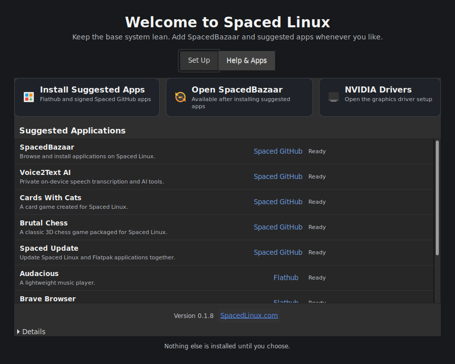

# Spaced Linux Welcome

Community help: [Discord](https://discord.gg/BMW9Y6NB3y) · [Telegram](https://t.me/+pjmFzHo-i9A2ZWY5)

Spaced Linux Welcome is the native first-run application installer for Spaced
Linux. It installs SpacedBazaar and a curated set of user Flatpaks from
Flathub and the signed Spaced GitHub repository after the OS is installed.



The UI always names the application and source currently being installed. Its
**Details** pane streams remote setup, Flatpak, retry, and failure output while
work is in progress.

The **Help & Apps** page starts with task-oriented recommendations for video,
photos, audio, email, coding, emulation, streaming, and games. Choosing one
launches its exact `appstream://` page in SpacedBazaar; the
user still confirms any installation in Bazaar.

**Open SpacedBazaar** installs just the app store when it is missing, then opens
it. Help & Apps links do the same and retain the requested application page.
The installer configures Flathub for runtime dependencies even when no suggested
Flathub applications are selected.

Help & Apps also includes offline guides for Android USB transfers, iPhone/iPad
pairing and shared documents, authenticated Windows/NAS shares, and starting
creative projects. Each guide includes troubleshooting and an upstream reference.

The **AI Setup** page detects the installed RAM and any NVIDIA GPU, recommends
a local Ollama model sized for that hardware, and downloads it with `ollama
pull` when Ollama is already installed (otherwise it shows the official
install command; Welcome never pipes a remote script to a shell on its own).
The same page records a few seconds of microphone audio and reports whether a
signal was detected, opens Sound Settings, checks for a webcam, Bluetooth,
battery, and Wi-Fi adapter, searches the local network for CUPS-discoverable
printers, and links short guides for continuing to set up Spaced Linux
(themes, snapshots, Compiz, and graphics drivers).

## Catalog

The structured catalog lives in `data/catalog.json`. Version 1 contains these
verified CRHY applications:

| Application | Flatpak ID | Delivery |
| --- | --- | --- |
| SpacedBazaar | `io.github.crhy.SpacedBazaar` | Signed `spaced-github` remote |
| Voice2Text AI | `io.github.crhy.voice2textai` | Signed `spaced-github` remote |
| Cards With Cats | `io.github.crhy.CardsWithCats` | Signed `spaced-github` remote |
| Brutal Chess | `io.github.crhy.BrutalChess` | Signed `spaced-github` remote |
| Spaced Update | `org.spacedlinux.SpacedUpdate` | Signed `spaced-github` remote |

Audacious, Brave, LibreOffice, and VLC are suggested from Flathub's `stable`
branch. Every catalog entry names its branch explicitly so a missing remote
branch fails validation before release instead of on an end user's machine.

SpacedBazaar's publication job validates each curated GitHub release bundle,
imports it into a GPG-signed OSTree repository, and regenerates AppStream
metadata. Welcome installs those reviewed applications by exact Flatpak ID from
that same `spaced-github` remote. This avoids mutable “latest release” downloads
at first login and gives every app a normal signed update path.

## Commands

```sh
spaced-welcome-install --list
spaced-welcome-install --list --json
spaced-welcome-install --install suggested
spaced-welcome-install --install cards-with-cats --events
spaced-welcome
spaced-welcome --page help
spaced-welcome --page ai-setup
```

`--events` emits newline-delimited JSON for the GTK UI and other front ends.
One failed application does not prevent the remaining suggestions from being
attempted.

The AI Setup page is backed by its own CLI:

```sh
spaced-welcome-ai-setup --detect-hardware --json
spaced-welcome-ai-setup --recommend-model
spaced-welcome-ai-setup --install-model qwen2.5:7b --events
spaced-welcome-ai-setup --test-microphone --json
spaced-welcome-ai-setup --open-sound-settings
spaced-welcome-ai-setup --check-peripherals --json
spaced-welcome-ai-setup --find-printers --json
spaced-welcome-ai-setup --open-printer-settings
```

## Development

```sh
make check
make deb
```

The package artifact is exactly `dist/spaced-welcome_$(cat VERSION)_all.deb`.

The behavioral test harness can inject commands and paths without weakening
production validation:

- `SPACED_WELCOME_CATALOG`
- `SPACED_WELCOME_FLATPAK`
- `SPACED_WELCOME_ATTEMPTS`
- `SPACED_WELCOME_RETRY_DELAY`
- `SPACED_WELCOME_INSTALLER`
- `SPACED_WELCOME_AI_SETUP`, `SPACED_WELCOME_OLLAMA`, `SPACED_WELCOME_ARECORD`,
  `SPACED_WELCOME_LPINFO`, `SPACED_WELCOME_SOUND_SETTINGS`,
  `SPACED_WELCOME_PRINTER_SETTINGS`, `SPACED_WELCOME_MEMINFO`,
  `SPACED_WELCOME_NVIDIA_SMI`, `SPACED_WELCOME_DEV_ROOT`,
  `SPACED_WELCOME_SYS_ROOT`

## Packaging and OS integration

This project ships a native `Architecture: all` Debian package because the
first-run app must invoke the host Flatpak installation, detect the live
session, refresh desktop exports, and launch Spaced Linux system tools. The
Flatpak build uses the standard host Flatpak portal for the same operations.

Spaced Linux should install only the small native `spaced-welcome` Debian
package in the live filesystem. On the installed system, the user can choose
**Install Suggested Apps** to fetch SpacedBazaar and the rest of the catalog.

## License

Copyright 2026 Spaced Linux Team. Licensed under the GNU General Public License,
version 3 or (at your option) any later version. See `LICENSE`.
